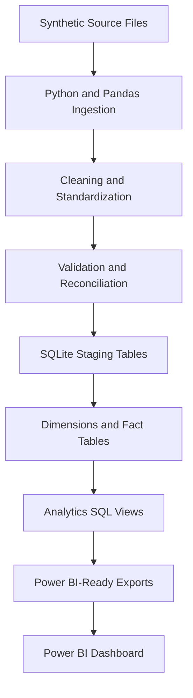

# Enterprise Workforce Analytics Data Model

This project builds a local workforce analytics pipeline using Python, Pandas, SQL, SQLite, and Power BI-ready CSV exports. It generates synthetic HR source files, cleans and validates the data, reconciles records across sources, loads a dimensional model, and exports reporting datasets that can be used to build a Power BI dashboard.

## Business Problem

Workforce reporting usually pulls from several systems: HR employee records, compensation files, department lists, job tables, manager hierarchy files, and planning spreadsheets. Those sources often disagree. This project shows how to turn messy workforce files into a reusable star schema that supports reporting on headcount, hiring, turnover, compensation, tenure, organization structure, and data quality.

## Main Features

- Generates fully synthetic workforce data for about 3,000 employees.
- Simulates common source issues such as duplicate employee IDs, invalid department codes, missing compensation, orphan compensation records, inconsistent labels, and date problems.
- Cleans and standardizes source data using Pandas.
- Validates business rules and stores issues in `fact_data_quality_issue`.
- Reconciles employee, compensation, payroll, headcount, and plan data.
- Builds eight dimensions and five fact tables in SQLite.
- Creates business-friendly SQL views for Power BI.
- Exports model tables and views as CSV files under `data/output`.
- Includes pytest coverage for cleaning, validation, reconciliation, and metrics.

## Technology Stack

- Python
- Pandas
- PyYAML
- SQLite
- SQL
- pytest
- Power BI, using exported CSV files or a SQLite ODBC connection

No Docker, Spark, Airflow, external APIs, or cloud accounts are required.

## Architecture



## Repository Structure

```text
.
├── README.md
├── requirements.txt
├── config/
│   └── config.yaml
├── data/
│   ├── raw/
│   ├── processed/
│   └── output/
├── database/
│   └── workforce_analytics.db
├── docs/
├── powerbi/
├── sql/
├── src/
└── tests/
```

## Data Model Overview

Dimensions:

- `dim_employee`
- `dim_department`
- `dim_location`
- `dim_job`
- `dim_manager`
- `dim_employment_type`
- `dim_date`
- `dim_compensation_band`

Fact tables:

- `fact_employee_snapshot`
- `fact_employment_event`
- `fact_compensation`
- `fact_workforce_plan`
- `fact_data_quality_issue`

Main Power BI views:

- `vw_current_workforce`
- `vw_monthly_headcount`
- `vw_hires_and_terminations`
- `vw_turnover_summary`
- `vw_compensation_summary`
- `vw_tenure_distribution`
- `vw_department_workforce`
- `vw_location_workforce`
- `vw_actual_vs_plan`
- `vw_data_quality_summary`

## Pipeline Workflow

The pipeline runs from `src/run_pipeline.py` and performs these steps:

1. Reads `config/config.yaml`.
2. Creates missing project folders.
3. Generates synthetic raw CSV files.
4. Ingests all source files.
5. Cleans names, codes, dates, salaries, booleans, and categorical labels.
6. Runs validation checks and records issues.
7. Runs reconciliation checks across employee, compensation, payroll, and plan data.
8. Loads staging tables in SQLite.
9. Builds dimensions, facts, and analytics views from SQL scripts.
10. Exports Power BI-ready CSV files.
11. Prints a pipeline summary.

## Setup

Create and activate a virtual environment if you want one:

```bash
python -m venv .venv
source .venv/bin/activate
```

Install dependencies:

```bash
pip install -r requirements.txt
```

## Run The Pipeline

From the repository root:

```bash
python src/run_pipeline.py
```

Expected outputs:

- Raw synthetic CSVs in `data/raw`
- Cleaned CSVs in `data/processed`
- SQLite database at `database/workforce_analytics.db`
- Power BI-ready CSV exports in `data/output`

## Run Tests

```bash
pytest
```

The tests cover text normalization, employment type mapping, date handling, duplicate detection, salary validation, compensation reconciliation, headcount logic, turnover logic, and actual-versus-plan variance.

## Power BI Setup

The simplest Power BI path is to import CSV files from `data/output`. Start with these:

- `vw_current_workforce.csv`
- `vw_monthly_headcount.csv`
- `vw_hires_and_terminations.csv`
- `vw_turnover_summary.csv`
- `vw_compensation_summary.csv`
- `vw_actual_vs_plan.csv`
- `vw_data_quality_summary.csv`

For a more model-driven report, import the dimensions and fact tables and create relationships using the surrogate keys. More detail is in [docs/power_bi_setup.md](docs/power_bi_setup.md).

## Key Workforce Metrics

The project defines metrics for:

- Active headcount
- Beginning, ending, and average headcount
- Hires and terminations
- Voluntary and involuntary terminations
- Turnover rate
- Average salary
- Total annual compensation
- Average tenure
- Planned headcount and headcount variance
- Compensation-band penetration
- Data-quality issue counts
- Validation pass rate

Formulas are documented in [docs/metric_definitions.md](docs/metric_definitions.md).

## Example Validation Rules

- Employee ID is present.
- Employee ID is unique in the employee master.
- Hire date is valid.
- Termination date is not earlier than hire date.
- Active employees do not have past termination dates.
- Department, location, job, manager, compensation, and event references are valid.
- Salary is numeric, positive, and within the configured range.
- Planned headcount is nonnegative.

## Example Reconciliation Checks

- Employees missing compensation records.
- Compensation records without valid employees.
- Employees assigned to invalid departments.
- Source employee count versus warehouse employee count.
- Active employees versus monthly snapshot totals.
- Total payroll before and after processing.
- Actual headcount versus workforce plan by department.

## Sample Project Outputs

After the latest run, the pipeline created:

- 2,983 employee dimension rows, including the unknown employee.
- 98,065 monthly employee snapshot rows.
- 4,110 employment event fact rows.
- 2,907 compensation fact rows.
- 720 workforce plan fact rows.
- 240 data-quality issue fact rows.
- 24 Power BI-ready CSV exports.

The exact counts may change if `config/config.yaml` is edited.

## Limitations

- The data is synthetic and intended for local analytics modeling practice.
- Employee snapshot facts use the employee's modeled department, job, location, and manager instead of reconstructing every historical transfer.
- SQLite is used for local repeatability, so some SQL syntax is adjusted for SQLite.
- The project does not include a `.pbix` file because that would be hard to verify in code and easy to fake.

## Future Improvements

- Add slowly changing dimension logic for employee department and job changes.
- Add optional PostgreSQL support.
- Add more reconciliation checks for event-level movement.
- Add a small Power BI screenshot folder after manually building the report.
