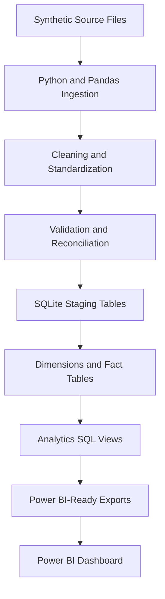

# Architecture

## Pipeline Flow

## Star Schema

```mermaid
erDiagram
    DIM_DATE ||--o{ FACT_EMPLOYEE_SNAPSHOT : snapshot_month_key
    DIM_EMPLOYEE ||--o{ FACT_EMPLOYEE_SNAPSHOT : employee_key
    DIM_DEPARTMENT ||--o{ FACT_EMPLOYEE_SNAPSHOT : department_key
    DIM_LOCATION ||--o{ FACT_EMPLOYEE_SNAPSHOT : location_key
    DIM_JOB ||--o{ FACT_EMPLOYEE_SNAPSHOT : job_key
    DIM_MANAGER ||--o{ FACT_EMPLOYEE_SNAPSHOT : manager_key
    DIM_EMPLOYMENT_TYPE ||--o{ FACT_EMPLOYEE_SNAPSHOT : employment_type_key

    DIM_DATE ||--o{ FACT_EMPLOYMENT_EVENT : event_date_key
    DIM_EMPLOYEE ||--o{ FACT_EMPLOYMENT_EVENT : employee_key
    DIM_DEPARTMENT ||--o{ FACT_EMPLOYMENT_EVENT : department_key
    DIM_JOB ||--o{ FACT_EMPLOYMENT_EVENT : job_key

    DIM_DATE ||--o{ FACT_COMPENSATION : effective_date_key
    DIM_EMPLOYEE ||--o{ FACT_COMPENSATION : employee_key
    DIM_COMPENSATION_BAND ||--o{ FACT_COMPENSATION : compensation_band_key

    DIM_DATE ||--o{ FACT_WORKFORCE_PLAN : plan_month_key
    DIM_DEPARTMENT ||--o{ FACT_WORKFORCE_PLAN : department_key

    DIM_EMPLOYEE {
        int employee_key PK
        string employee_id
        string full_name
        string employment_status
    }
    DIM_DEPARTMENT {
        int department_key PK
        string department_code
        string department_name
    }
    DIM_LOCATION {
        int location_key PK
        string location_code
        string city
    }
    DIM_JOB {
        int job_key PK
        string job_code
        string job_title
        string job_level
    }
    FACT_EMPLOYEE_SNAPSHOT {
        int snapshot_key PK
        int snapshot_month_key FK
        int employee_key FK
        int headcount
        int tenure_months
    }
    FACT_EMPLOYMENT_EVENT {
        int event_key PK
        int event_date_key FK
        string event_type
        int event_count
    }
    FACT_COMPENSATION {
        int compensation_key PK
        int employee_key FK
        float annual_salary
    }
    FACT_WORKFORCE_PLAN {
        int plan_key PK
        int department_key FK
        float planned_headcount
    }
```

## Notes

- Raw CSV files are generated locally and labeled as synthetic.
- Staging tables keep cleaned records before dimensional modeling.
- Unknown dimension rows use key `0` so facts can keep records with missing or invalid references.
- Power BI can either use exported business-friendly views or the full star schema.
